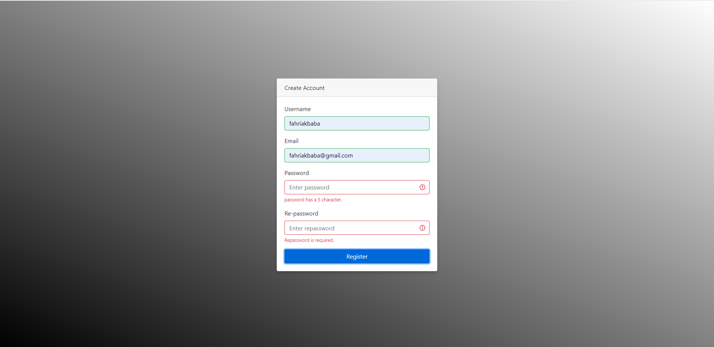

<h1>Form Validation using Vanilla JS</h1>

This projesct was created following tools

<ul>
    <li>HTML5</li>
    <li>CSS3</li>
    <li>Bootstrap</li>
    <li>Vanilla JS (especially using regex and forEach method)</li>
    <li>You can access <a href="https://fahriakbaba-form-validation-using-js.netlify.app/" target="_blank">this link of project.</a></li>
</ul>

 

